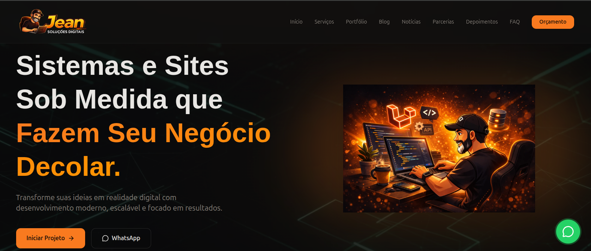
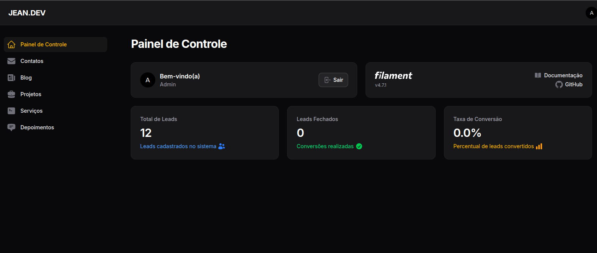

# 🚀 Jean Soluções Digitais — Plataforma de Aquisição e Conversão de Clientes

O **Jean Soluções Digitais** é uma plataforma web completa desenvolvida para posicionamento profissional, geração de leads e apresentação de serviços digitais.

O projeto combina um site institucional moderno com um CMS completo para gestão de conteúdo e acompanhamento de oportunidades de negócio.

---

## 🎯 Objetivo

Criar uma plataforma capaz de:

* atrair clientes através de presença digital
* apresentar serviços de forma estratégica
* capturar leads automaticamente
* gerenciar contatos e oportunidades
* transformar visitas em projetos reais

---

## ⚙️ Principais funcionalidades

### 🌐 Frontend (site institucional)

* landing page com foco em conversão
* seção de serviços com proposta de valor
* portfólio de projetos
* depoimentos (social proof)
* FAQ estratégico
* formulário de orçamento
* página de blog e conteúdos
* agregador de notícias de tecnologia
* página de parcerias

---

### 🧠 Geração e gestão de leads

* formulários integrados ao sistema
* cadastro automático de leads no backend
* classificação por tipo (cliente ou parceiro)
* acompanhamento de status (novo, em andamento, fechado)

---

### 🛠️ Backend (CMS)

* painel administrativo completo (FilamentPHP)
* gestão de leads e contatos
* gestão de blog e conteúdos
* gestão de projetos (portfólio)
* gestão de serviços
* gestão de depoimentos (com LGPD)
* controle de publicação e visibilidade

---

### 📊 Dashboard de negócio

* total de leads
* leads convertidos
* taxa de conversão
* visão geral de oportunidades

---

## 🧠 Diferenciais técnicos

* 🎯 **Plataforma focada em conversão de clientes**
* 📊 **Dashboard com métricas de negócio**
* 🧩 **CMS completo e customizado**
* 🔍 **SEO e conteúdo dinâmico**
* 🤖 **Agregador automático de notícias tech**
* ⚖️ **Adequação à LGPD**

---

## 🏗️ Arquitetura

* **Backend:** Laravel
* **Admin:** FilamentPHP
* **Frontend:** HTML, CSS, JavaScript (custom)
* **Banco:** MySQL
* **Mídia:** Spatie Media Library

📄 Detalhes técnicos: [Arquitetura do sistema](./docs/arquitetura.md)

---

## 🔄 Fluxo do sistema

1. Usuário acessa o site
2. Navega pelos serviços e portfólio
3. Preenche formulário de orçamento ou parceria
4. Lead é registrado automaticamente no sistema
5. Admin gerencia no painel
6. Lead evolui até conversão

---

## 📸 Demonstração

<h3 align="center">Página Inicial</h3>

  

<h3 align="center">Painel Administrativo</h3>

  

---

## 🔗 Acesso

👉 https://jeancarlos.com.br/

---

## 🚧 Status

Projeto ativo e em evolução contínua.

---

## 👨‍💻 Autor

Jean Carlos Charão Sabino
🔗 https://jeancarlos.com.br
🔗 https://www.linkedin.com/in/jeancarloscharaosabino/
